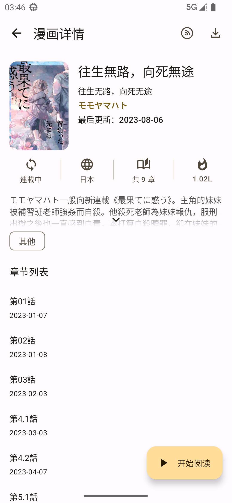
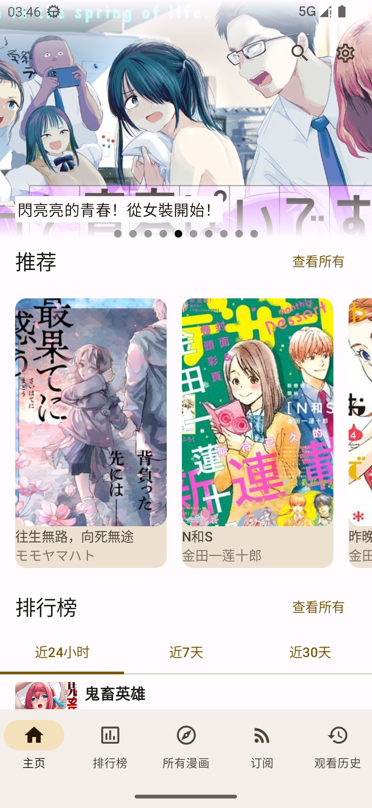
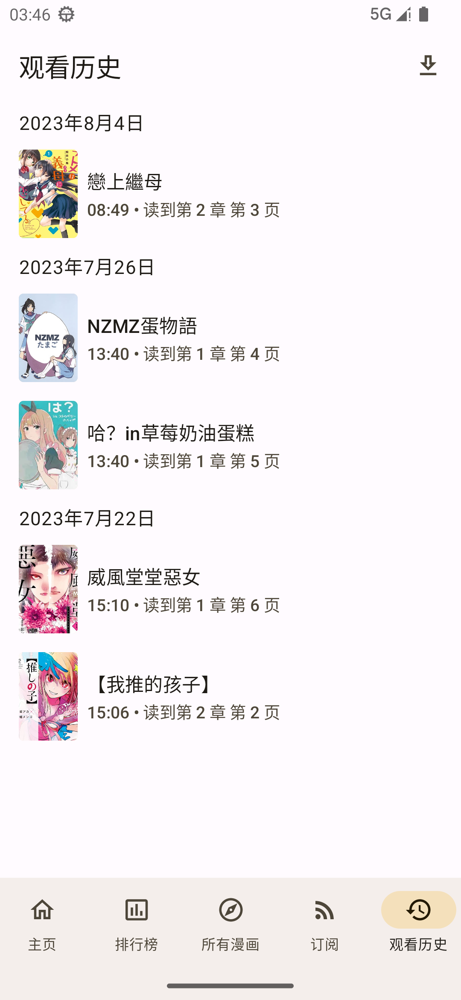
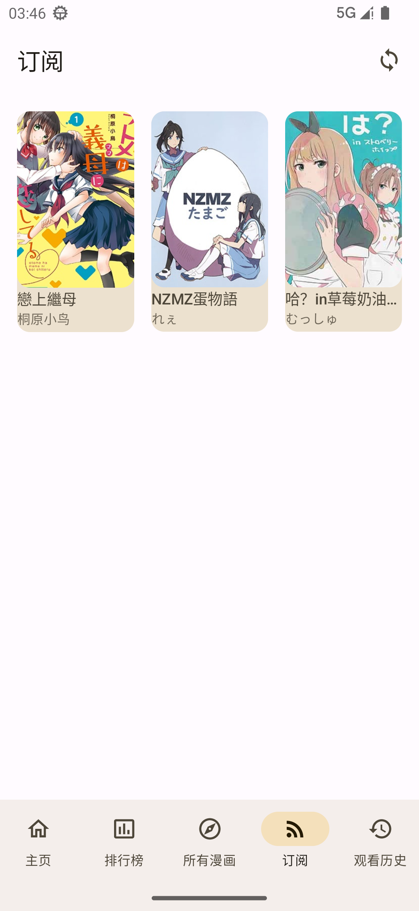
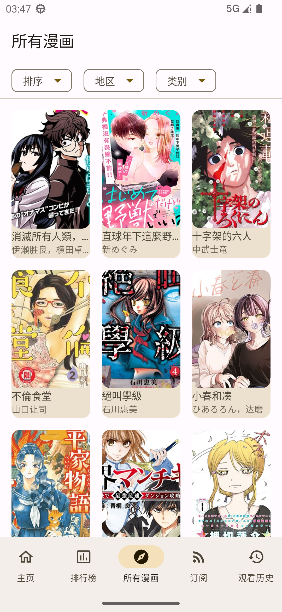

# CopyMangaJava
 

一个第三方的拷贝漫画带有M3(Material You)风格，支持动态主题。该App已通过Kotlin来实现，只是标题没改。注意：如果您感觉加载慢的话而且没有使用VPN的话，建议打开设置中的“使用境外CDN”,说不定可以加载得出来。

希望大家可以多使用官方App，我写这个App只是用来练习。这个里面的代码都很简单，即使以后也可以给初学者一定的帮助。但我并不推荐您来查看我的代码。如果您想要学习的话，Kotatsu 和 Tachiyomi的代码完全够用。多看几遍就可以弄懂。

下载功能只能下载，在联网加载的时候会加载本地下载的漫画，但是我还没完成离线观看的逻辑。下载目录在 _Android/com.shicheeng.copymanga/Downloads_ 下面，您可以自己手动复制到其他地方下观看。

本项目部分迁移到Compose。

**注意：请务必卸载以前的那个早期版本**
## 灵感来源

* [fumiama/copymanga](https://github.com/fumiama/copymanga)
* [misaka10843/copymanga-downloader](https://github.com/misaka10843/copymanga-downloader)
* [tachiyomi](https://github.com/tachiyomiorg/tachiyomi)
* [kotatsu](https://github.com/KotatsuApp/Kotatsu)

## 截屏

## 关于Api
api 来源于官方app API

## 后续功能
* ~~下载~~（现在可离线查看下载的漫画）
* ~~记录位置~~（将历史记录保存在本地）
* 登录
* ~~搜索~~(已完成)

## License
MIT License

### 中文解释如下（来自[维基百科](https://zh.wikipedia.org/wiki/MIT%E8%A8%B1%E5%8F%AF%E8%AD%89)）
#### 被许可人权利
特此授予任何人免费获得本软件和相关文档文件（“软件”）副本的许可，不受限制地处理本软件，包括但不限于使用、复制、修改、合并 、发布、分发、再许可的权利， 被许可人有权利使用、复制、修改、合并、出版发行、散布、再许可和/或贩售软件及软件的副本，及授予被供应人同等权利，惟服从以下义务。

#### 被许可人义务
在软件和软件的所有副本中都必须包含以上著作权声明和本许可声明。
