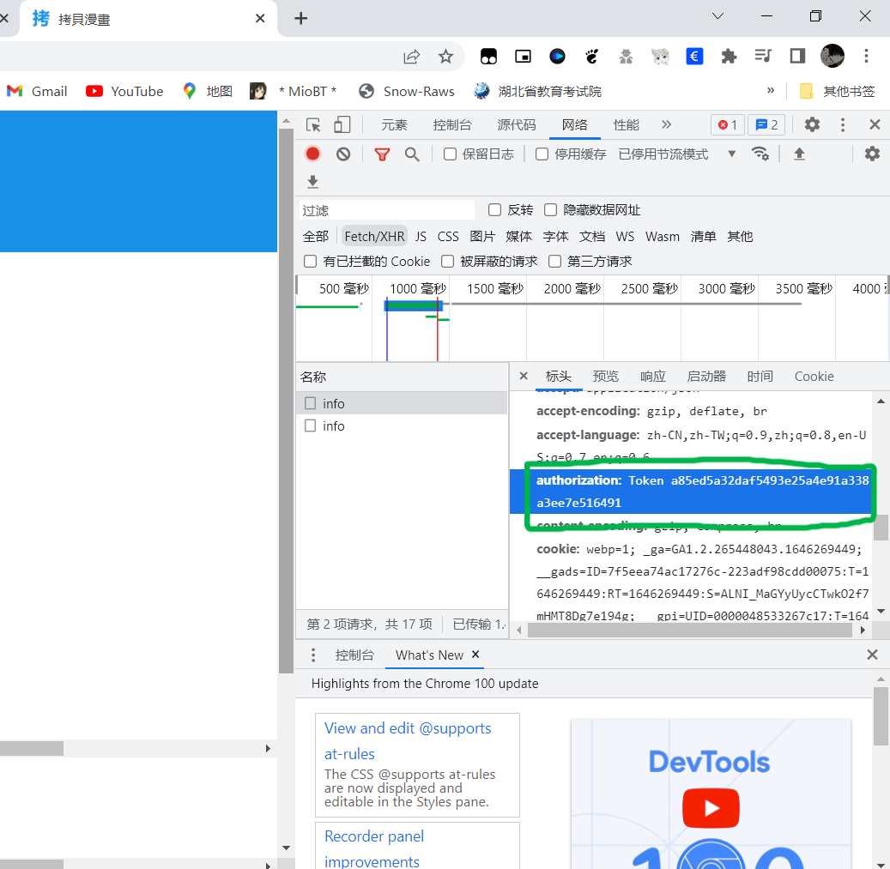
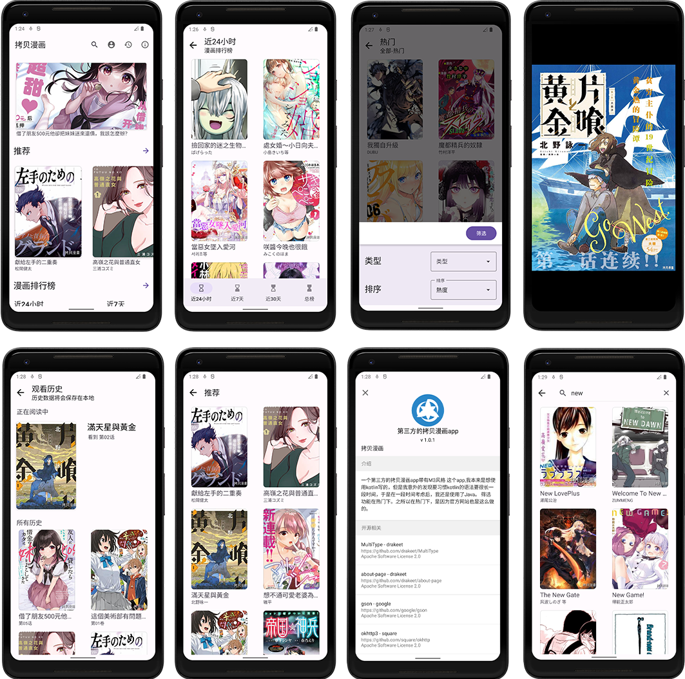

# CopyMangaJava
 A third-part Android App project of CopyManga
 
 一个第三方的拷贝漫画app M3风格

这个app,我本来是想使用kotlin写的，但是我意外的发现要习惯kotlin的语法要很长一段时间，于是在一段时间考虑后，我还是使用了Java。

目前，该app可以查看漫画和筛选漫画，筛选功能在**热门**下。之所以在热门下，是因为官方网站也是这么做的。后续将会解决掉 **~~下载~~** 和 **~~阅读记录~~** 和 **登录**。

## 灵感来源

* [fumiama/copymanga](https://github.com/fumiama/copymanga)
* [misaka10843/copymanga-downloader](https://github.com/misaka10843/copymanga-downloader)

## 登录

如果需要登录，那么可能需要在[官网](http://www.copymanga.com)上找到Token。
使用网页浏览器自带的开发者工具（F12）。
如图所示

一定要连token一起输入。

## 截屏

[查看](https://github.com/shizheng233/CopyMangaJava/tree/main/sreenshots)所有截图

## 关于Api
api 来源于官方app API

## 后续功能
为啥会很慢，因为我很懒。这个里面的代码都很简单，即使以后也可以给初学者一定的帮助。
* 下载
* ~~记录位置~~（将历史记录保存在本地）
* 登录
* ~~搜索~~(已完成，但是只能显示前16个结果，等有个机会再改进下)
* 其他

## License
MIT License

### 中文解释如下（来自[维基百科](https://zh.wikipedia.org/wiki/MIT%E8%A8%B1%E5%8F%AF%E8%AD%89)）
#### 被许可人权利
特此授予任何人免费获得本软件和相关文档文件（“软件”）副本的许可，不受限制地处理本软件，包括但不限于使用、复制、修改、合并 、发布、分发、再许可的权利， 被许可人有权利使用、复制、修改、合并、出版发行、散布、再许可和/或贩售软件及软件的副本，及授予被供应人同等权利，惟服从以下义务。

#### 被许可人义务
在软件和软件的所有副本中都必须包含以上著作权声明和本许可声明。
