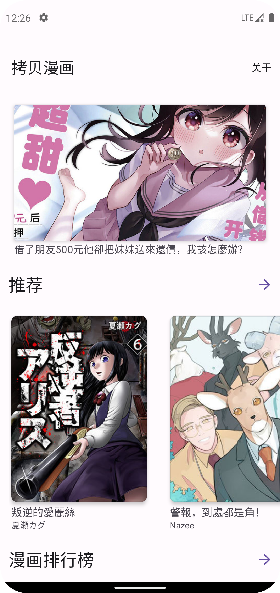
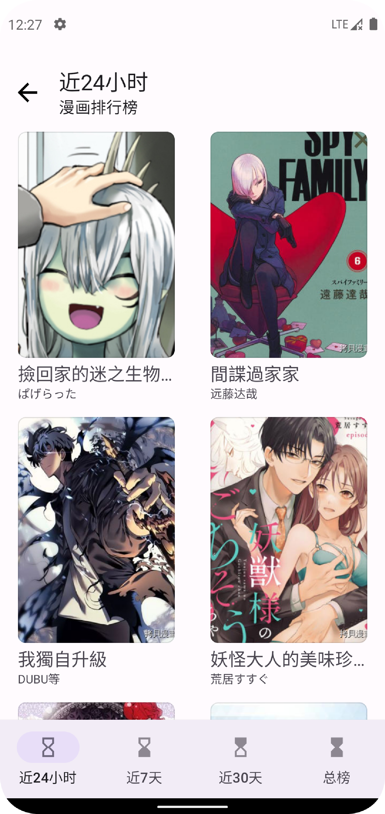
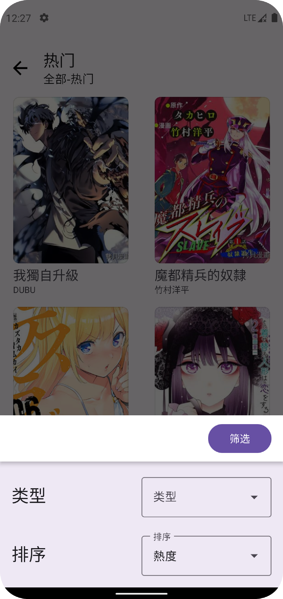
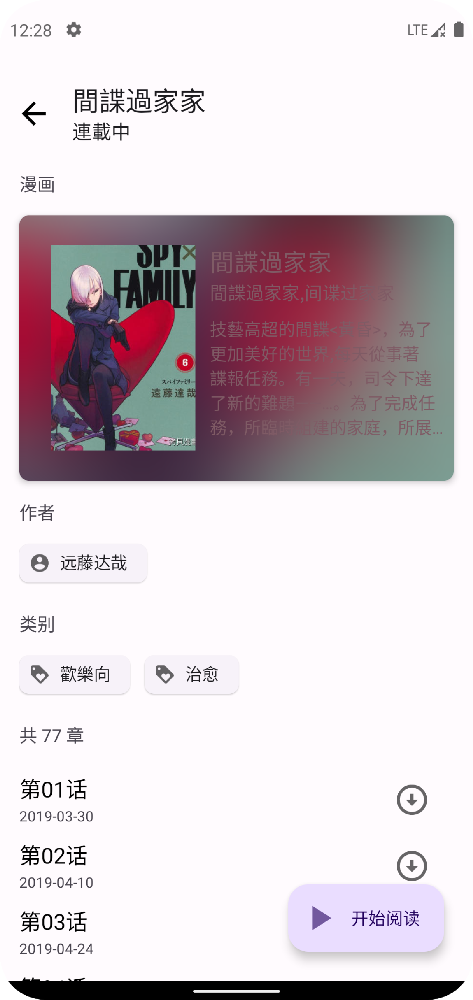

# CopyMangaJava
 A third-part Android App project of CopyManga
 
 一个第三方的拷贝漫画app M3风格

这个app,我本来是想使用kotlin写的，但是我意外的发现要习惯kotlin的语法要很长一段时间，于是在一段时间考虑后，我还是使用了Java。

目前，该app可以查看漫画和筛选漫画，筛选功能在**热门**下。之所以在热门下，是因为官方网站也是这么做的。后续将会解决掉**下载**和**阅读记录**和**登录**。

## 灵感来源

* [fumiama/copymanga](https://github.com/fumiama/copymanga)
* [misaka10843/copymanga-downloader](https://github.com/misaka10843/copymanga-downloader)

## 截屏

<frgure class="sh">
    
</frgure>

## 关于Api
api 来源于官方app API

## 后续功能
为啥会很慢，因为我很懒。这个里面的代码都很简单，即使以后也可以给初学者一定的帮助。
* 下载
* 记录位置
* 登录
* 搜索
* 其他

## License
MIT
